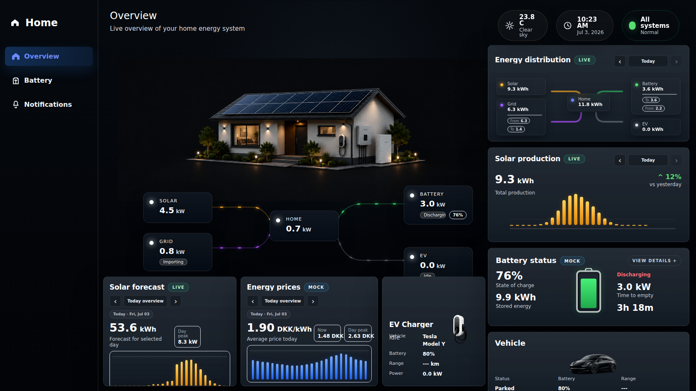
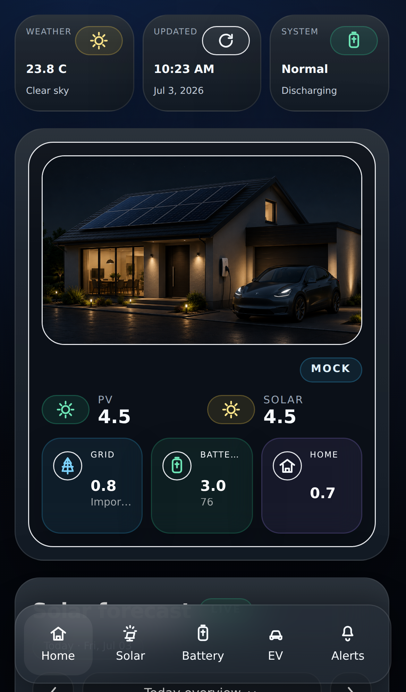

# Energy Dashboard HAKit

A React + TypeScript + Vite dashboard for Home Assistant built with HAKit.

## Preview

### Desktop



### Mobile



The project provides:
- a desktop dashboard with energy flow, battery, solar, EV, pricing, and notifications
- a mobile dashboard with dedicated Home, Solar, Battery, EV, and Notifications screens
- Home Assistant package files for EVCC, FoxESS, pricing, battery optimizer, helpers, and notifications
- optional standalone backend services for notifications and battery optimization

## Requirements

- Node.js 20.19+ or 22.12+
- npm
- Home Assistant

## Development

```bash
npm install
cp .env.example .env
npm run dev -- --host 0.0.0.0
```

Useful scripts:

```bash
npm run typecheck
npm run lint
npm run build
npm run build:ha
npm run test:e2e
npm run security:check
```

## Environment

The default production-safe environment is in `.env.example`.

```bash
VITE_HA_URL=
VITE_HA_TOKEN=
VITE_ENABLE_DIRECT_BROWSER_APIS=false
VITE_BATTERY_OPTIMIZER_MODE=ha-proxy
VITE_BATTERY_OPTIMIZER_BASE_URL=
VITE_NOTIFICATIONS_BASE_URL=
VITE_PEAK_RATE_URL=disabled
VITE_EVCC_URL=
VITE_EVCC_SOLAR_FORECAST_URL=disabled
VITE_EVCC_SESSIONS_URL=disabled
```

Guidelines:
- keep `VITE_HA_TOKEN` empty in production
- keep `VITE_ENABLE_DIRECT_BROWSER_APIS=false` in production
- prefer Home Assistant as the integration layer for EVCC, pricing, optimizer, and notifications
- only enable direct browser APIs deliberately for controlled environments

## Production Deployment

Build for Home Assistant:

```bash
npm run build:ha
```

Copy the built files into Home Assistant's `www` directory:

```bash
mkdir -p /path/to/home-assistant/config/www/energy-dashboard-hakit
rsync -a --delete dist/ /path/to/home-assistant/config/www/energy-dashboard-hakit/
```

Open the dashboard at:

```text
https://YOUR_HOME_ASSISTANT_HOST/local/energy-dashboard-hakit/index.html
```

If the dashboard is hosted outside Home Assistant, set `VITE_HA_URL` to the Home Assistant origin reachable by the browser before building.

## Security

The repo is configured for a Home-Assistant-first deployment model.

Recommended production setup:
- let Home Assistant provide auth/session access
- keep FoxESS keys, optimizer tokens, and notification secrets server-side only
- use Home Assistant REST sensors, scripts, and package files for backend integrations
- do not commit real `.env` files or `/config/secrets.yaml`

Run the repository safety check before pushing:

```bash
npm run security:check
```

This checks for:
- tracked `.env` files
- tracked `home-assistant/secrets.yaml`
- known secret patterns
- private LAN URLs that should be placeholders in committed files

## Home Assistant Packages

Preferred split package layout:

```text
home-assistant/
  energy_dashboard_helpers.yaml
  energy_dashboard_evcc.yaml
  energy_dashboard_foxess.yaml
  energy_dashboard_battery_optimizer.yaml
  energy_dashboard_notifications.yaml
  energy_dashboard_prices.yaml
```

Copy these files to `/config/packages/` and enable package loading in `configuration.yaml`:

```yaml
homeassistant:
  packages: !include_dir_named packages
```

Important:
- use the split package files or the legacy combined package, not both
- the combined file `home-assistant/energy-dashboard-hakit.yaml` is legacy only

### Secrets

Use the example file:

```text
home-assistant/secrets.example.yaml
```

Copy it to your private Home Assistant secrets file and fill in real values:

```text
/config/secrets.yaml
```

Never commit the real secrets file.

## Service Integration Overview

### EVCC

Handled through the Home Assistant EVCC package:
- charge mode changes
- charge plan helpers and scripts
- charge sessions
- EVCC solar tariff/forecast feed

Primary package file:
- `home-assistant/energy_dashboard_evcc.yaml`

### FoxESS

Handled through the Home Assistant FoxESS package:
- daily totals
- derived solar/grid/home/battery sensors
- Fox Cloud API polling from Home Assistant

Primary package file:
- `home-assistant/energy_dashboard_foxess.yaml`

### Pricing

Handled through the Home Assistant pricing package:
- hourly electricity prices
- dashboard price attributes

Primary package file:
- `home-assistant/energy_dashboard_prices.yaml`

### Battery optimizer

The UI supports:
- optimizer status
- plan table
- controls
- charts

Recommended production mode:
- `VITE_BATTERY_OPTIMIZER_MODE=ha-proxy`

Primary files:
- `src/hooks/useBatteryOptimizer.ts`
- `src/services/batteryOptimizer.ts`
- `src/services/batteryOptimizerClient.ts`
- `home-assistant/energy_dashboard_battery_optimizer.yaml`

### Notifications

Notifications use:
- browser push subscription in the frontend
- a standalone notifications backend
- Home Assistant scripts/rest commands as the source of truth for sending alerts

Primary files:
- `src/hooks/useNotifications.ts`
- `src/services/notificationsClient.ts`
- `src/components/notifications/NotificationsScreen.tsx`
- `home-assistant/energy_dashboard_notifications.yaml`

## Entity Mapping

Entity placeholders live in:

- `src/data/energyEntities.ts`

Update those mappings to match your Home Assistant entities.

Unknown, unavailable, or missing values render as `---`.

## Project Structure

```text
src/
  components/
    battery/
    dashboard/desktop/
    ev/
    mobile/
    notifications/
    shared/
  hooks/
  models/
  services/
  data/
home-assistant/
public/
server/
tests/
```

High-level responsibility split:
- `src/components/*`: presentational UI
- `src/hooks/*`: orchestration and state
- `src/models/*`: shared domain types
- `src/services/*`: normalization, adapters, pure helpers, and API clients
- `home-assistant/*`: package files and examples
- `server/*`: optional standalone backend services

## Frontend Styling

The UI is primarily Tailwind-based, with a small remaining CSS layer for specialized flow animation and scene behavior.

Core styling files:
- `tailwind.config.ts`
- `postcss.config.js`
- `src/index.css`
- `src/components/EnergyDashboard.css`

Guidelines for future changes:
- prefer Tailwind utilities and shared primitives
- reuse shared glass surface styles where possible
- keep special-purpose CSS limited to effects that are awkward in utilities alone

## Testing

Automated coverage includes:
- unit tests for data shaping and helpers
- Playwright end-to-end coverage
- optional live integration tests when external credentials are explicitly provided

The FoxESS integration test is opt-in and only runs when these environment variables are set:

```bash
TEST_FOXESS_API_KEY=...
TEST_FOXESS_DEVICE_SN=...
TEST_FOXESS_API_DOMAIN=https://www.foxesscloud.com
TEST_FOXESS_TIMEZONE=Europe/Copenhagen
```

## Assets

Primary dashboard assets live in:
- `public/new-energy-dashboard/`
- `public/mobile-dashboard/`

The active desktop scene uses:
- `public/new-energy-dashboard/background.png`

## License / Usage

Review and add your preferred project license before public distribution if one is not already in place.
